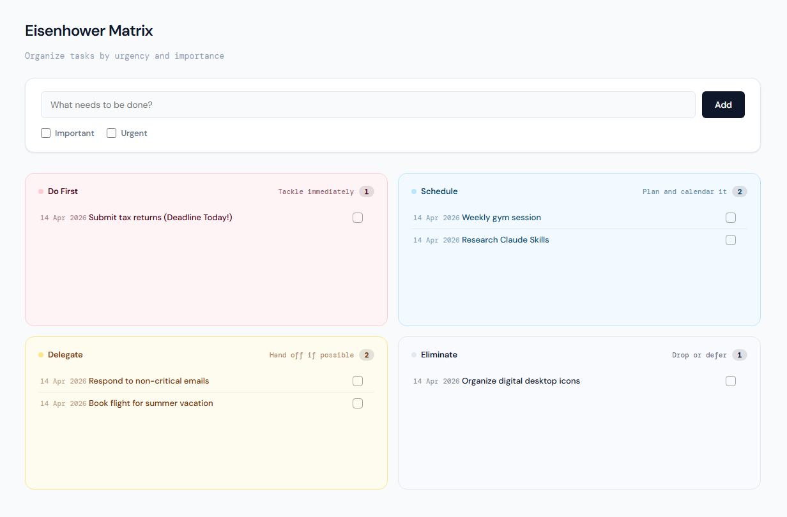

# eisenhower-matrix
A productivity-focused Todo application, utilizing the Eisenhower Matrix to prioritize tasks by urgency and importance.

This monorepo containing two versions of an Eisenhower Matrix task manager.

1. The **React PWA version** — a minimal, offline-capable app built with React 19 and localStorage. No backend, no accounts, no sync.

    👉 [Try it live](https://yc-tan.github.io/eisenhower-matrix/)
    For installation and development, see the [frontend README](./frontend/README.md).

    